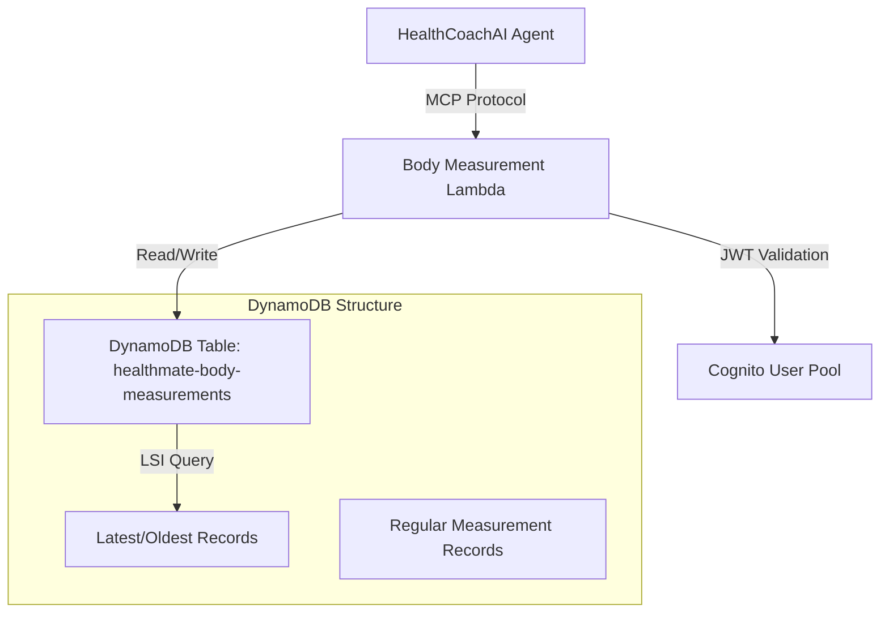

# 設計文書

## 概要

身体測定値記録機能は、HealthManagerサービスに新しいMCPツールとDynamoDBテーブルを追加して実装します。ユーザーがAIエージェントとの自然な対話を通じて体重、身長、体脂肪率を記録し、効率的に履歴を管理できるシステムを構築します。

## アーキテクチャ

### システム構成図



### データフロー

1. **測定値記録フロー**
   - ユーザー → AIエージェント → MCP addBodyMeasurement → Lambda → DynamoDB
   - 新規レコード作成 + Latest レコード更新

2. **データ取得フロー**
   - AIエージェント → MCP getLatestMeasurements → Lambda → DynamoDB LSI → 最新データ返却

## コンポーネントと インターフェース

### Lambda関数: Body Measurement Handler

**ファイル**: `lambda/body_measurement/handler.py`

**責任**:
- MCP ツールリクエストの処理
- 測定データのバリデーション
- DynamoDB への読み書き操作
- Latest/Oldest レコードの管理

**インターフェース**:
```python
def lambda_handler(event: Dict[str, Any], context: Any) -> Dict[str, Any]:
    """
    MCP ツールリクエストを処理
    
    Args:
        event: {
            "tool": str,  # ツール名
            "parameters": dict,  # ツールパラメータ
            "jwt_token": str  # 認証トークン
        }
    
    Returns:
        {
            "success": bool,
            "data": dict,
            "message": str
        }
    """
```

### MCP ツール仕様

#### 1. addBodyMeasurement
```python
{
    "name": "addBodyMeasurement",
    "description": "身体測定値を記録する",
    "parameters": {
        "weight": {"type": "number", "description": "体重(kg)", "optional": True},
        "height": {"type": "number", "description": "身長(cm)", "optional": True},
        "body_fat_percentage": {"type": "number", "description": "体脂肪率(%)", "optional": True},
        "measurement_time": {"type": "string", "description": "測定時刻(ISO format)", "optional": True}
    }
}
```

#### 2. updateBodyMeasurement
```python
{
    "name": "updateBodyMeasurement",
    "description": "既存の測定記録を更新する",
    "parameters": {
        "measurement_id": {"type": "string", "description": "測定記録ID(timestamp)"},
        "weight": {"type": "number", "description": "体重(kg)", "optional": True},
        "height": {"type": "number", "description": "身長(cm)", "optional": True},
        "body_fat_percentage": {"type": "number", "description": "体脂肪率(%)", "optional": True}
    }
}
```

#### 3. deleteBodyMeasurement
```python
{
    "name": "deleteBodyMeasurement",
    "description": "測定記録を削除する",
    "parameters": {
        "measurement_id": {"type": "string", "description": "測定記録ID(timestamp)"}
    }
}
```

#### 4. getLatestMeasurements
```python
{
    "name": "getLatestMeasurements",
    "description": "最新の測定値を取得する",
    "parameters": {}
}
```

#### 5. getOldestMeasurements
```python
{
    "name": "getOldestMeasurements", 
    "description": "最古の測定値を取得する",
    "parameters": {}
}
```

#### 6. getMeasurementHistory
```python
{
    "name": "getMeasurementHistory",
    "description": "指定期間の測定履歴を取得する",
    "parameters": {
        "start_date": {"type": "string", "description": "開始日(YYYY-MM-DD)"},
        "end_date": {"type": "string", "description": "終了日(YYYY-MM-DD)"},
        "limit": {"type": "number", "description": "取得件数上限", "optional": True}
    }
}
```

## データモデル

### DynamoDB テーブル: healthmate-body-measurements

**テーブル構造**:
```python
{
    "TableName": "healthmate-body-measurements",
    "KeySchema": [
        {"AttributeName": "PK", "KeyType": "HASH"},    # USER#{user_id}
        {"AttributeName": "SK", "KeyType": "RANGE"}    # MEASUREMENT#{timestamp}
    ],
    "LocalSecondaryIndexes": [
        {
            "IndexName": "RecordTypeIndex",
            "KeySchema": [
                {"AttributeName": "PK", "KeyType": "HASH"},
                {"AttributeName": "record_type", "KeyType": "RANGE"}
            ]
        }
    ]
}
```

**レコード形式**:

1. **通常の測定レコード**:
```json
{
    "PK": "USER#12345",
    "SK": "MEASUREMENT#2024-12-20T08:00:00Z",
    "weight": 65.2,
    "height": 170.5,
    "body_fat_percentage": 15.8,
    "measurement_time": "2024-12-20T08:00:00Z",
    "created_at": "2024-12-20T08:05:00Z"
}
```

2. **Latest レコード**:
```json
{
    "PK": "USER#12345", 
    "SK": "MEASUREMENT#latest",
    "record_type": "latest",
    "weight": 65.2,
    "height": 170.5,
    "body_fat_percentage": 15.8,
    "last_weight_update": "2024-12-20T08:00:00Z",
    "last_height_update": "2024-12-15T09:00:00Z",
    "last_body_fat_update": "2024-12-20T08:00:00Z",
    "updated_at": "2024-12-20T08:05:00Z"
}
```

3. **Oldest レコード**:
```json
{
    "PK": "USER#12345",
    "SK": "MEASUREMENT#oldest", 
    "record_type": "oldest",
    "weight": 68.0,
    "height": 170.5,
    "body_fat_percentage": 18.2,
    "first_weight_record": "2024-01-15T10:00:00Z",
    "first_height_record": "2024-01-15T10:00:00Z", 
    "first_body_fat_record": "2024-01-20T09:00:00Z",
    "created_at": "2024-01-15T10:05:00Z"
}
```

### Latest/Oldest レコード管理ロジック

#### Latest レコード更新ロジック
```python
### 初回記録時の特別処理

#### 初回記録時のLatest/Oldest同期
```python
async def handle_first_measurement(user_id: str, measurement: dict, measurement_time: str):
    """初回測定記録時の特別処理"""
    
    # 既存の測定記録があるかチェック
    existing_measurements = await get_all_user_measurements(user_id)
    regular_measurements = [
        r for r in existing_measurements 
        if r["SK"] not in ["MEASUREMENT#latest", "MEASUREMENT#oldest"]
    ]
    
    is_first_measurement = len(regular_measurements) == 0
    
    if is_first_measurement:
        # 初回記録の場合、Latest と Oldest に同じデータを設定
        base_record_data = {
            **measurement,
            "measurement_time": measurement_time,
            "created_at": datetime.utcnow().isoformat()
        }
        
        # Latest レコード作成
        latest_record = {
            "PK": f"USER#{user_id}",
            "SK": "MEASUREMENT#latest",
            "record_type": "latest",
            **base_record_data,
            "updated_at": datetime.utcnow().isoformat()
        }
        
        # Oldest レコード作成（同じデータ）
        oldest_record = {
            "PK": f"USER#{user_id}",
            "SK": "MEASUREMENT#oldest", 
            "record_type": "oldest",
            **base_record_data
        }
        
        # 各測定タイプの時刻情報を追加
        for measurement_type in ["weight", "height", "body_fat_percentage"]:
            if measurement_type in measurement:
                # Latest レコード用
                latest_record[f"last_{measurement_type}_update"] = measurement_time
                # Oldest レコード用
                oldest_record[f"first_{measurement_type}_record"] = measurement_time
        
        # 両方のレコードを保存
        await save_record(latest_record)
        await save_record(oldest_record)
        
        return True  # 初回記録であることを示す
    
    return False  # 通常の記録処理を継続

async def add_body_measurement(user_id: str, measurement: dict, measurement_time: str = None):
    """身体測定値追加のメイン処理"""
    
    if measurement_time is None:
        measurement_time = datetime.utcnow().isoformat()
    
    # 通常の測定記録を保存
    measurement_record = {
        "PK": f"USER#{user_id}",
        "SK": f"MEASUREMENT#{measurement_time}",
        **measurement,
        "measurement_time": measurement_time,
        "created_at": datetime.utcnow().isoformat()
    }
    await save_record(measurement_record)
    
    # 初回記録かどうかチェックして適切に処理
    is_first = await handle_first_measurement(user_id, measurement, measurement_time)
    
    if not is_first:
        # 通常の Latest/Oldest 更新処理
        await update_latest_record(user_id, measurement, measurement_time)
        await update_oldest_record(user_id, measurement, measurement_time)
    
    return measurement_record
```

#### 部分測定タイプの初回記録処理
```python
async def handle_partial_measurement_types(user_id: str, new_measurement: dict, measurement_time: str):
    """部分的な測定タイプの初回記録処理"""
    
    current_latest = await get_latest_record(user_id)
    current_oldest = await get_oldest_record(user_id)
    
    # Latest レコードの更新
    if current_latest:
        updated_latest = current_latest.copy()
        for measurement_type, value in new_measurement.items():
            if measurement_type in ["weight", "height", "body_fat_percentage"]:
                updated_latest[measurement_type] = value
                updated_latest[f"last_{measurement_type}_update"] = measurement_time
        updated_latest["updated_at"] = datetime.utcnow().isoformat()
        await save_record(updated_latest)
    
    # Oldest レコードの更新（新しい測定タイプの場合のみ）
    if current_oldest:
        updated_oldest = current_oldest.copy()
        for measurement_type, value in new_measurement.items():
            if measurement_type in ["weight", "height", "body_fat_percentage"]:
                # まだ記録されていない測定タイプの場合のみ追加
                if measurement_type not in updated_oldest:
                    updated_oldest[measurement_type] = value
                    updated_oldest[f"first_{measurement_type}_record"] = measurement_time
        await save_record(updated_oldest)
```

#### データ整合性の例

**シナリオ1: 完全初回記録**
```json
// 初回: 体重、身長、体脂肪率を同時記録
{
  "weight": 65.2,
  "height": 170.5, 
  "body_fat_percentage": 15.8
}

// Latest レコード
{
  "PK": "USER#12345",
  "SK": "MEASUREMENT#latest",
  "record_type": "latest",
  "weight": 65.2,
  "height": 170.5,
  "body_fat_percentage": 15.8,
  "last_weight_update": "2024-12-20T08:00:00Z",
  "last_height_update": "2024-12-20T08:00:00Z",
  "last_body_fat_update": "2024-12-20T08:00:00Z"
}

// Oldest レコード（同じデータ）
{
  "PK": "USER#12345", 
  "SK": "MEASUREMENT#oldest",
  "record_type": "oldest",
  "weight": 65.2,
  "height": 170.5,
  "body_fat_percentage": 15.8,
  "first_weight_record": "2024-12-20T08:00:00Z",
  "first_height_record": "2024-12-20T08:00:00Z",
  "first_body_fat_record": "2024-12-20T08:00:00Z"
}
```

**シナリオ2: 部分的初回記録**
```json
// 初回: 体重のみ記録
{
  "weight": 65.2
}

// Latest レコード
{
  "PK": "USER#12345",
  "SK": "MEASUREMENT#latest", 
  "record_type": "latest",
  "weight": 65.2,
  "last_weight_update": "2024-12-20T08:00:00Z"
}

// Oldest レコード（同じデータ）
{
  "PK": "USER#12345",
  "SK": "MEASUREMENT#oldest",
  "record_type": "oldest", 
  "weight": 65.2,
  "first_weight_record": "2024-12-20T08:00:00Z"
}

// 2回目: 身長を追加記録
{
  "height": 170.5
}

// Latest レコード（更新）
{
  "PK": "USER#12345",
  "SK": "MEASUREMENT#latest",
  "record_type": "latest",
  "weight": 65.2,           // 前回の値を保持
  "height": 170.5,          // 新しい値
  "last_weight_update": "2024-12-20T08:00:00Z",
  "last_height_update": "2024-12-20T09:00:00Z"
}

// Oldest レコード（新測定タイプ追加）
{
  "PK": "USER#12345",
  "SK": "MEASUREMENT#oldest",
  "record_type": "oldest",
  "weight": 65.2,           // 初回の値を保持
  "height": 170.5,          // 初回の身長値
  "first_weight_record": "2024-12-20T08:00:00Z",
  "first_height_record": "2024-12-20T09:00:00Z"
}
```
    """Latest レコードを更新する"""
    
    # 現在のLatest レコードを取得
    current_latest = await get_latest_record(user_id)
    
    if not current_latest:
        # Latest レコードが存在しない場合は新規作成
        latest_record = {
            "PK": f"USER#{user_id}",
            "SK": "MEASUREMENT#latest",
            "record_type": "latest",
            **new_measurement,
            "updated_at": datetime.utcnow().isoformat()
        }
        
        # 各測定タイプの最終更新時刻を記録
        for measurement_type in ["weight", "height", "body_fat_percentage"]:
            if measurement_type in new_measurement:
                latest_record[f"last_{measurement_type}_update"] = measurement_time
        
        await save_record(latest_record)
        return
    
    # 既存のLatest レコードを更新
    updated_latest = current_latest.copy()
    
    for measurement_type, value in new_measurement.items():
        if measurement_type in ["weight", "height", "body_fat_percentage"]:
            # 新しい測定値で更新
            updated_latest[measurement_type] = value
            updated_latest[f"last_{measurement_type}_update"] = measurement_time
    
    updated_latest["updated_at"] = datetime.utcnow().isoformat()
    await save_record(updated_latest)

async def recalculate_latest_record_after_update(user_id: str, updated_measurement_id: str):
    """測定記録更新後のLatest レコード再計算"""
    
    # 更新された記録が最新かどうか確認
    updated_record = await get_measurement_record(user_id, updated_measurement_id)
    all_measurements = await get_all_user_measurements(user_id)
    
    # 各測定タイプの最新値を再計算
    latest_values = {}
    last_update_times = {}
    
    for measurement_type in ["weight", "height", "body_fat_percentage"]:
        # 該当測定タイプを含む記録を時系列順にソート
        records_with_type = [
            r for r in all_measurements 
            if measurement_type in r and r["SK"] != "MEASUREMENT#latest" and r["SK"] != "MEASUREMENT#oldest"
        ]
        records_with_type.sort(key=lambda x: x["measurement_time"], reverse=True)
        
        if records_with_type:
            latest_values[measurement_type] = records_with_type[0][measurement_type]
            last_update_times[f"last_{measurement_type}_update"] = records_with_type[0]["measurement_time"]
    
    # Latest レコードを更新
    if latest_values:
        latest_record = {
            "PK": f"USER#{user_id}",
            "SK": "MEASUREMENT#latest", 
            "record_type": "latest",
            **latest_values,
            **last_update_times,
            "updated_at": datetime.utcnow().isoformat()
        }
        await save_record(latest_record)

async def recalculate_latest_record_after_deletion(user_id: str, deleted_measurement_id: str):
    """測定記録削除後のLatest レコード再計算"""
    
    # 残りの全測定記録を取得
    remaining_measurements = await get_all_user_measurements(user_id)
    regular_measurements = [
        r for r in remaining_measurements 
        if r["SK"] not in ["MEASUREMENT#latest", "MEASUREMENT#oldest"]
    ]
    
    if not regular_measurements:
        # 測定記録が全て削除された場合、Latest レコードも削除
        await delete_record(user_id, "MEASUREMENT#latest")
        return
    
    # 各測定タイプの最新値を再計算
    latest_values = {}
    last_update_times = {}
    
    for measurement_type in ["weight", "height", "body_fat_percentage"]:
        records_with_type = [
            r for r in regular_measurements 
            if measurement_type in r
        ]
        records_with_type.sort(key=lambda x: x["measurement_time"], reverse=True)
        
        if records_with_type:
            latest_values[measurement_type] = records_with_type[0][measurement_type]
            last_update_times[f"last_{measurement_type}_update"] = records_with_type[0]["measurement_time"]
    
    # Latest レコードを更新
    if latest_values:
        latest_record = {
            "PK": f"USER#{user_id}",
            "SK": "MEASUREMENT#latest",
            "record_type": "latest", 
            **latest_values,
            **last_update_times,
            "updated_at": datetime.utcnow().isoformat()
        }
        await save_record(latest_record)
```

#### Oldest レコード管理ロジック
```python
async def update_oldest_record(user_id: str, new_measurement: dict, measurement_time: str):
    """Oldest レコードを更新する（初回記録時のみ）"""
    
    current_oldest = await get_oldest_record(user_id)
    
    if not current_oldest:
        # Oldest レコードが存在しない場合は新規作成
        oldest_record = {
            "PK": f"USER#{user_id}",
            "SK": "MEASUREMENT#oldest",
            "record_type": "oldest",
            **new_measurement,
            "created_at": datetime.utcnow().isoformat()
        }
        
        # 各測定タイプの初回記録時刻を記録
        for measurement_type in ["weight", "height", "body_fat_percentage"]:
            if measurement_type in new_measurement:
                oldest_record[f"first_{measurement_type}_record"] = measurement_time
        
        await save_record(oldest_record)
        return
    
    # 既存のOldest レコードに新しい測定タイプを追加
    updated_oldest = current_oldest.copy()
    
    for measurement_type, value in new_measurement.items():
        if measurement_type in ["weight", "height", "body_fat_percentage"]:
            # まだ記録されていない測定タイプの場合のみ追加
            if measurement_type not in updated_oldest:
                updated_oldest[measurement_type] = value
                updated_oldest[f"first_{measurement_type}_record"] = measurement_time
    
    await save_record(updated_oldest)

async def recalculate_oldest_record_after_deletion(user_id: str, deleted_measurement_id: str):
    """測定記録削除後のOldest レコード再計算"""
    
    # 残りの全測定記録を取得
    remaining_measurements = await get_all_user_measurements(user_id)
    regular_measurements = [
        r for r in remaining_measurements 
        if r["SK"] not in ["MEASUREMENT#latest", "MEASUREMENT#oldest"]
    ]
    
    if not regular_measurements:
        # 測定記録が全て削除された場合、Oldest レコードも削除
        await delete_record(user_id, "MEASUREMENT#oldest")
        return
    
    # 各測定タイプの最古値を再計算
    oldest_values = {}
    first_record_times = {}
    
    for measurement_type in ["weight", "height", "body_fat_percentage"]:
        records_with_type = [
            r for r in regular_measurements 
            if measurement_type in r
        ]
        records_with_type.sort(key=lambda x: x["measurement_time"])  # 昇順ソート
        
        if records_with_type:
            oldest_values[measurement_type] = records_with_type[0][measurement_type]
            first_record_times[f"first_{measurement_type}_record"] = records_with_type[0]["measurement_time"]
    
    # Oldest レコードを更新
    if oldest_values:
        oldest_record = {
            "PK": f"USER#{user_id}",
            "SK": "MEASUREMENT#oldest",
            "record_type": "oldest",
            **oldest_values,
            **first_record_times,
            "updated_at": datetime.utcnow().isoformat()
        }
        await save_record(oldest_record)
```

### データアクセスパターン

1. **最新測定値取得**:
```python
# LSI を使用した効率的なクエリ
response = table.query(
    IndexName="RecordTypeIndex",
    KeyConditionExpression=Key('PK').eq(f'USER#{user_id}') & 
                          Key('record_type').eq('latest')
)
```

2. **履歴範囲取得**:
```python
# 日付範囲でのクエリ
response = table.query(
    KeyConditionExpression=Key('PK').eq(f'USER#{user_id}') & 
                          Key('SK').between(
                              f'MEASUREMENT#{start_timestamp}',
                              f'MEASUREMENT#{end_timestamp}'
                          )
)
```

3. **特定記録の更新**:
```python
# 条件付き更新（所有権確認）
response = table.update_item(
    Key={
        'PK': f'USER#{user_id}',
        'SK': f'MEASUREMENT#{measurement_id}'
    },
    UpdateExpression="SET #w = :weight, #h = :height",
    ConditionExpression="attribute_exists(PK)",  # レコード存在確認
    ExpressionAttributeNames={
        '#w': 'weight',
        '#h': 'height'
    },
    ExpressionAttributeValues={
        ':weight': new_weight,
        ':height': new_height
    }
)
```

4. **記録削除と再計算**:
```python
# トランザクション処理で一貫性保証
async def delete_measurement_with_recalculation(user_id: str, measurement_id: str):
    # 1. 削除対象レコードを取得
    target_record = await get_measurement_record(user_id, measurement_id)
    
    # 2. 削除実行
    await delete_record(user_id, f'MEASUREMENT#{measurement_id}')
    
    # 3. Latest/Oldest レコードの再計算
    await recalculate_latest_record_after_deletion(user_id, measurement_id)
    await recalculate_oldest_record_after_deletion(user_id, measurement_id)
```

## 正確性プロパティ

*プロパティとは、システムの全ての有効な実行において真であるべき特性や動作のことです。これらは人間が読める仕様と機械で検証可能な正確性保証の橋渡しとなります。*

### プロパティ 1: 測定値記録の往復一貫性
*任意の* 有効な測定値（体重、身長、体脂肪率）について、記録してから取得した場合、元の値と同じ小数点精度で取得できる
**検証: 要件 2.4, 2.5, 2.6**

### プロパティ 2: タイムスタンプ指定の正確性
*任意の* 測定値と指定時刻について、指定時刻付きで記録した場合、その時刻で正確に記録される
**検証: 要件 1.2**

### プロパティ 3: 複数測定値の同期記録
*任意の* 複数測定値の組み合わせについて、同時に記録した場合、全て同じタイムスタンプで記録される
**検証: 要件 1.3**

### プロパティ 4: Latest レコードの部分更新不変性
*任意の* 既存測定履歴と新しい部分測定値について、部分更新を行った場合、更新されなかった測定タイプの値は以前の最新値を保持する
**検証: 要件 1.5, 3.3**

### プロパティ 5: Latest レコードの最新性保証
*任意の* ユーザーの測定履歴について、Latest レコードは各測定タイプの最新値を含む
**検証: 要件 3.1**

### プロパティ 6: Oldest レコードの最古性保証
*任意の* ユーザーの測定履歴について、Oldest レコードは各測定タイプの最古値を含む
**検証: 要件 3.2**

### プロパティ 7: DynamoDB キー構造の一貫性
*任意の* 測定記録について、パーティションキーは "USER#{user_id}" 形式、ソートキーは "MEASUREMENT#{timestamp}" 形式で格納される
**検証: 要件 2.2, 2.3**

### プロパティ 8: Record Type 属性の制限
*任意の* DynamoDB レコードについて、record_type 属性は "latest" または "oldest" の特別レコードにのみ存在し、通常の測定レコードには存在しない
**検証: 要件 3.5**

### プロパティ 9: 測定値一意性
*任意の* ユーザーについて、各測定記録は一意のタイムスタンプを持つ
**検証: 要件 2.1**

### プロパティ 10: JWT認証の必須性
*任意の* MCPツール呼び出しについて、無効または欠如したJWTトークンの場合は認証エラーが返される
**検証: 要件 4.5**

### プロパティ 11: 無効測定値の拒否
*任意の* 無効な測定値について、システムは入力を拒否し、説明的なエラーメッセージを返す
**検証: 要件 5.1**

### プロパティ 13: 測定記録更新の正確性
*任意の* 既存測定記録と新しい測定値について、更新操作を行った場合、指定された測定値のみが変更され、他の値は保持される
**検証: 要件 4.1**

### プロパティ 14: Latest レコード再計算（更新時）
*任意の* 最新測定記録の更新について、Latest レコードが適切に再計算される
**検証: 要件 4.2**

### プロパティ 15: 測定記録削除の完全性
*任意の* 測定記録について、削除操作を行った場合、そのレコードはデータベースから完全に除去される
**検証: 要件 4.3**

### プロパティ 16: Latest レコード再計算（削除時）
*任意の* 最新測定記録の削除について、Latest レコードが残りの記録から適切に再計算される
**検証: 要件 4.4**

### プロパティ 17: Oldest レコード再計算（削除時）
*任意の* 最古測定記録の削除について、Oldest レコードが残りの記録から適切に再計算される
**検証: 要件 4.5**

### プロパティ 19: 初回記録時のLatest/Oldest同期
*任意の* ユーザーの初回測定記録について、Latest レコードと Oldest レコードは同じ測定値と時刻情報を含む
**検証: 要件 3.1, 3.2**

### プロパティ 20: 部分測定タイプの初回記録整合性
*任意の* 新しい測定タイプの初回記録について、Oldest レコードにその測定タイプが追加され、Latest レコードが更新される
**検証: 要件 1.5, 3.1, 3.2**
## エラーハンドリング

### バリデーションエラー
```python
class MeasurementValidationError(Exception):
    """測定値バリデーションエラー"""
    pass

def validate_measurement_values(weight=None, height=None, body_fat_percentage=None):
    """測定値の妥当性を検証"""
    errors = []
    
    if weight is not None:
        if not isinstance(weight, (int, float)) or weight <= 0 or weight > 1000:
            errors.append("体重は1-1000kgの範囲で入力してください")
    
    if height is not None:
        if not isinstance(height, (int, float)) or height < 50 or height > 300:
            errors.append("身長は50-300cmの範囲で入力してください")
    
    if body_fat_percentage is not None:
        if not isinstance(body_fat_percentage, (int, float)) or body_fat_percentage < 0 or body_fat_percentage > 100:
            errors.append("体脂肪率は0-100%の範囲で入力してください")
    
    if errors:
        raise MeasurementValidationError("; ".join(errors))
```

### DynamoDB エラーハンドリング
```python
def handle_dynamodb_error(error):
    """DynamoDB例外をMCP形式エラーに変換"""
    error_code = error.response['Error']['Code']
    
    if error_code == 'ConditionalCheckFailedException':
        return {
            "success": False,
            "error": "RESOURCE_NOT_FOUND",
            "message": "指定された測定記録が見つかりません"
        }
    elif error_code == 'ValidationException':
        return {
            "success": False,
            "error": "VALIDATION_ERROR", 
            "message": "入力データの形式が正しくありません"
        }
    else:
        return {
            "success": False,
            "error": "INTERNAL_ERROR",
            "message": "内部エラーが発生しました"
        }
```

### JWT認証エラー
```python
def validate_jwt_token(jwt_token):
    """JWTトークンの妥当性を検証"""
    if not jwt_token:
        raise AuthenticationError("JWTトークンが提供されていません")
    
    try:
        # JWT デコードとユーザーID抽出
        user_id = extract_user_id_from_jwt(jwt_token)
        if not user_id:
            raise AuthenticationError("有効なユーザーIDが見つかりません")
        return user_id
    except Exception as e:
        raise AuthenticationError(f"JWT認証に失敗しました: {str(e)}")
```

## テスト戦略

### 二重テストアプローチ
- **単体テスト**: 特定の例、エッジケース、エラー条件を検証
- **プロパティテスト**: 全入力にわたる汎用プロパティを検証
- 両方が補完的で包括的なカバレッジに必要

### プロパティベーステスト設定
- **テストライブラリ**: pytest + hypothesis
- **最小反復回数**: 各プロパティテストで100回
- **テストタグ形式**: **Feature: body-measurements, Property {number}: {property_text}**

### テスト例

#### 単体テスト
```python
def test_add_body_measurement_success():
    """体重記録の正常系テスト"""
    event = {
        "tool": "addBodyMeasurement",
        "parameters": {"weight": 65.2},
        "jwt_token": "valid_jwt_token"
    }
    result = lambda_handler(event, None)
    assert result["success"] is True
    assert "measurement_id" in result["data"]

def test_invalid_weight_rejection():
    """無効な体重値の拒否テスト"""
    event = {
        "tool": "addBodyMeasurement", 
        "parameters": {"weight": -10},
        "jwt_token": "valid_jwt_token"
    }
    result = lambda_handler(event, None)
    assert result["success"] is False
    assert "範囲" in result["message"]
```

#### プロパティテスト
```python
from hypothesis import given, strategies as st

@given(
    weight=st.floats(min_value=1.0, max_value=1000.0),
    height=st.floats(min_value=50.0, max_value=300.0),
    body_fat=st.floats(min_value=0.0, max_value=100.0)
)
def test_measurement_round_trip_consistency(weight, height, body_fat):
    """Feature: body-measurements, Property 1: 測定値記録の往復一貫性"""
    # 測定値を記録
    add_result = add_body_measurement(weight, height, body_fat)
    assert add_result["success"] is True
    
    # 記録した値を取得
    get_result = get_latest_measurements()
    assert get_result["success"] is True
    
    # 往復一貫性を検証
    assert abs(get_result["data"]["weight"] - weight) < 0.01
    assert abs(get_result["data"]["height"] - height) < 0.01
    assert abs(get_result["data"]["body_fat_percentage"] - body_fat) < 0.01

@given(
    measurements=st.lists(
        st.tuples(
            st.floats(min_value=1.0, max_value=1000.0),  # weight
            st.floats(min_value=50.0, max_value=300.0),  # height
            st.floats(min_value=0.0, max_value=100.0)    # body_fat
        ),
        min_size=1,
        max_size=10
    )
)
def test_multiple_measurements_same_timestamp(measurements):
    """Feature: body-measurements, Property 3: 複数測定値の同期記録"""
    weight, height, body_fat = measurements[0]
    
    # 複数測定値を同時記録
    result = add_body_measurement(weight, height, body_fat)
    assert result["success"] is True
    
    # 記録されたタイムスタンプを取得
    history = get_measurement_history()
    latest_record = history["data"][0]
    
    # 全ての測定値が同じタイムスタンプを持つことを検証
    assert latest_record["measurement_time"] is not None
    # 実際の実装では、同じリクエスト内の測定値は同じタイムスタンプを持つ
```

### 統合テスト
```python
async def test_mcp_integration_full_flow():
    """MCP プロトコル統合テスト"""
    # 実際のAWS環境でのE2Eテスト
    mcp_client = MCPClient(gateway_endpoint)
    
    # 測定値記録
    add_response = await mcp_client.call_tool(
        "body-measurement", "addBodyMeasurement", 
        {"weight": 65.2, "height": 170.5}
    )
    assert add_response["success"] is True
    
    # 最新値取得
    get_response = await mcp_client.call_tool(
        "body-measurement", "getLatestMeasurements", {}
    )
    assert get_response["success"] is True
    assert get_response["data"]["weight"] == 65.2
    assert get_response["data"]["height"] == 170.5
```

## CDK インフラストラクチャ統合

### 既存スタックへの追加
```python
# cdk/cdk/healthmanager_stack.py に追加

def create_body_measurement_resources(self):
    """身体測定関連リソースの作成"""
    
    # DynamoDB テーブル
    self.body_measurements_table = dynamodb.Table(
        self, "BodyMeasurementsTable",
        table_name="healthmate-body-measurements",
        partition_key=dynamodb.Attribute(
            name="PK", type=dynamodb.AttributeType.STRING
        ),
        sort_key=dynamodb.Attribute(
            name="SK", type=dynamodb.AttributeType.STRING
        ),
        local_secondary_indexes=[
            dynamodb.LocalSecondaryIndex(
                index_name="RecordTypeIndex",
                sort_key=dynamodb.Attribute(
                    name="record_type", type=dynamodb.AttributeType.STRING
                )
            )
        ],
        billing_mode=dynamodb.BillingMode.PAY_PER_REQUEST,
        removal_policy=RemovalPolicy.DESTROY
    )
    
    # Lambda 関数
    self.body_measurement_lambda = _lambda.Function(
        self, "BodyMeasurementLambda",
        function_name="healthmate-BodyMeasurementLambda",
        runtime=_lambda.Runtime.PYTHON_3_12,
        handler="handler.lambda_handler",
        code=_lambda.Code.from_asset("lambda/body_measurement"),
        environment={
            "BODY_MEASUREMENTS_TABLE_NAME": self.body_measurements_table.table_name,
            "AWS_REGION": self.region
        },
        timeout=Duration.seconds(30)
    )
    
    # DynamoDB アクセス権限
    self.body_measurements_table.grant_read_write_data(self.body_measurement_lambda)
```

### MCP スキーマ統合
```json
// mcp-schema/body-measurement-mcp-schema.json
{
  "tools": [
    {
      "name": "addBodyMeasurement",
      "description": "身体測定値を記録する",
      "inputSchema": {
        "type": "object",
        "properties": {
          "weight": {
            "type": "number",
            "description": "体重(kg)",
            "minimum": 1,
            "maximum": 1000
          },
          "height": {
            "type": "number", 
            "description": "身長(cm)",
            "minimum": 50,
            "maximum": 300
          },
          "body_fat_percentage": {
            "type": "number",
            "description": "体脂肪率(%)",
            "minimum": 0,
            "maximum": 100
          },
          "measurement_time": {
            "type": "string",
            "description": "測定時刻(ISO format)",
            "format": "date-time"
          }
        }
      }
    },
    {
      "name": "updateBodyMeasurement",
      "description": "既存の測定記録を更新する",
      "inputSchema": {
        "type": "object",
        "properties": {
          "measurement_id": {
            "type": "string",
            "description": "測定記録ID(timestamp)"
          },
          "weight": {
            "type": "number",
            "description": "体重(kg)",
            "minimum": 1,
            "maximum": 1000
          },
          "height": {
            "type": "number",
            "description": "身長(cm)",
            "minimum": 50,
            "maximum": 300
          },
          "body_fat_percentage": {
            "type": "number",
            "description": "体脂肪率(%)",
            "minimum": 0,
            "maximum": 100
          }
        },
        "required": ["measurement_id"]
      }
    },
    {
      "name": "deleteBodyMeasurement",
      "description": "測定記録を削除する",
      "inputSchema": {
        "type": "object",
        "properties": {
          "measurement_id": {
            "type": "string",
            "description": "測定記録ID(timestamp)"
          }
        },
        "required": ["measurement_id"]
      }
    },
    {
      "name": "getLatestMeasurements",
      "description": "最新の測定値を取得する",
      "inputSchema": {
        "type": "object",
        "properties": {}
      }
    },
    {
      "name": "getOldestMeasurements",
      "description": "最古の測定値を取得する", 
      "inputSchema": {
        "type": "object",
        "properties": {}
      }
    },
    {
      "name": "getMeasurementHistory",
      "description": "指定期間の測定履歴を取得する",
      "inputSchema": {
        "type": "object",
        "properties": {
          "start_date": {
            "type": "string",
            "description": "開始日(YYYY-MM-DD)",
            "format": "date"
          },
          "end_date": {
            "type": "string", 
            "description": "終了日(YYYY-MM-DD)",
            "format": "date"
          },
          "limit": {
            "type": "number",
            "description": "取得件数上限",
            "minimum": 1,
            "maximum": 100,
            "default": 50
          }
        },
        "required": ["start_date", "end_date"]
      }
    }
  ]
}
```