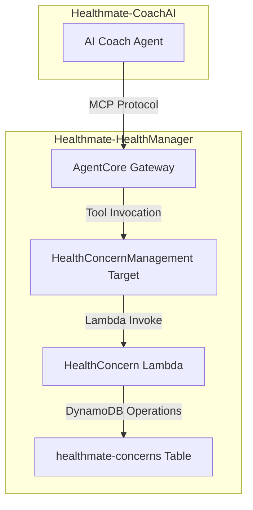

# 設計書

## 概要

HealthConcernManagement機能は、Healthmate-HealthManagerサービスに追加される新しいMCPツールセットです。ユーザーの身体面・メンタル面の悩みや不調を管理し、AIコーチが適切なアドバイスを提供するためのデータ基盤を提供します。

この機能は既存のHealthGoalManagement（ポジティブな将来目標）とは対照的に、現在の悩みや不調（ネガティブな現状）を管理することで、包括的な健康管理を実現します。

## アーキテクチャ

### システム構成図



### レイヤー構成

1. **プロトコル層**: Model Context Protocol (MCP)
2. **ゲートウェイ層**: Amazon Bedrock AgentCore Gateway
3. **ビジネスロジック層**: AWS Lambda Function
4. **データ永続化層**: Amazon DynamoDB

## コンポーネントと インターフェース

### 1. MCP ツール定義

#### AddConcern
```json
{
  "name": "AddConcern",
  "description": "新しい健康上の悩みを追加する",
  "inputSchema": {
    "type": "object",
    "properties": {
      "userId": {
        "type": "string",
        "description": "ユーザーID（Cognito User ID）"
      },
      "category": {
        "type": "array",
        "items": {
          "type": "string",
          "enum": ["PHYSICAL", "MENTAL"]
        },
        "description": "悩みのカテゴリ（PHYSICAL、MENTAL、または両方）"
      },
      "description": {
        "type": "string",
        "description": "悩みの詳細説明（例: 仕事のストレスで胃が痛く、眠りが浅い）"
      },
      "severity": {
        "type": "integer",
        "minimum": 1,
        "maximum": 5,
        "description": "深刻度（1-5、デフォルト: 3）"
      },
      "triggers": {
        "type": "string",
        "description": "悩み事が発生するトリガー（例: 低気圧、寝不足）"
      },
      "history": {
        "type": "string",
        "description": "これまでの対処履歴（例: 薬は効かない。ストレッチが有効。）"
      }
    },
    "required": ["userId", "category", "description"]
  }
}
```

#### UpdateConcern
```json
{
  "name": "UpdateConcern",
  "description": "既存の健康上の悩みを更新する",
  "inputSchema": {
    "type": "object",
    "properties": {
      "userId": {
        "type": "string",
        "description": "ユーザーID"
      },
      "concernId": {
        "type": "string",
        "description": "悩みID（UUID）"
      },
      "category": {
        "type": "array",
        "items": {
          "type": "string",
          "enum": ["PHYSICAL", "MENTAL"]
        },
        "description": "悩みのカテゴリ"
      },
      "description": {
        "type": "string",
        "description": "悩みの詳細説明"
      },
      "severity": {
        "type": "integer",
        "minimum": 1,
        "maximum": 5,
        "description": "深刻度（1-5）"
      },
      "status": {
        "type": "string",
        "enum": ["ACTIVE", "IMPROVED", "RESOLVED"],
        "description": "ステータス"
      },
      "triggers": {
        "type": "string",
        "description": "悩み事が発生するトリガー"
      },
      "history": {
        "type": "string",
        "description": "これまでの対処履歴"
      }
    },
    "required": ["userId", "concernId"]
  }
}
```

#### DeleteConcern
```json
{
  "name": "DeleteConcern",
  "description": "指定した健康上の悩みを削除する",
  "inputSchema": {
    "type": "object",
    "properties": {
      "userId": {
        "type": "string",
        "description": "ユーザーID"
      },
      "concernId": {
        "type": "string",
        "description": "悩みID（UUID）"
      }
    },
    "required": ["userId", "concernId"]
  }
}
```

#### GetConcerns
```json
{
  "name": "GetConcerns",
  "description": "ユーザーのすべての健康上の悩みを取得する",
  "inputSchema": {
    "type": "object",
    "properties": {
      "userId": {
        "type": "string",
        "description": "ユーザーID"
      },
      "status": {
        "type": "string",
        "enum": ["ACTIVE", "IMPROVED", "RESOLVED"],
        "description": "ステータスでフィルタリング（オプション）"
      },
      "category": {
        "type": "string",
        "enum": ["PHYSICAL", "MENTAL"],
        "description": "カテゴリでフィルタリング（オプション）"
      }
    },
    "required": ["userId"]
  }
}
```

### 2. Lambda Function 設計

#### 関数構成
- **関数名**: `healthmanagermcp-health-concern{環境サフィックス}`
- **ランタイム**: Python 3.12
- **ハンドラー**: `health_concern.handler.lambda_handler`
- **タイムアウト**: 30秒
- **メモリ**: 256MB

#### 環境変数
```python
{
    "CONCERNS_TABLE_NAME": "healthmate-concerns{環境サフィックス}",
    "HEALTHMATE_ENV": "dev|staging|prod",
    "LOG_LEVEL": "INFO|DEBUG|WARNING|ERROR"
}
```

#### 関数インターフェース
```python
def lambda_handler(event: Dict[str, Any], context: Any) -> Dict[str, Any]:
    """
    Lambda関数のエントリーポイント
    
    Args:
        event: AgentCore Gatewayからのイベント（MCPツール呼び出し）
        context: Lambda実行コンテキスト（ツール名を含む）

    Returns:
        MCP形式のレスポンス
        {
            "success": bool,
            "data": dict,  # 成功時のデータ
            "error": str,  # エラー時のメッセージ
            "errorType": str  # エラー種別
        }
    """
```

### 3. DynamoDB テーブル設計

#### テーブル構造
```python
{
    "TableName": "healthmate-concerns{環境サフィックス}",
    "KeySchema": [
        {
            "AttributeName": "userId",
            "KeyType": "HASH"  # パーティションキー
        },
        {
            "AttributeName": "concernId", 
            "KeyType": "RANGE"  # ソートキー
        }
    ],
    "AttributeDefinitions": [
        {
            "AttributeName": "userId",
            "AttributeType": "S"
        },
        {
            "AttributeName": "concernId",
            "AttributeType": "S"
        },
        {
            "AttributeName": "status",
            "AttributeType": "S"
        },
        {
            "AttributeName": "createdAt",
            "AttributeType": "S"
        }
    ],
    "BillingMode": "PAY_PER_REQUEST"
}
```

#### Global Secondary Index (GSI)

##### status-index
```python
{
    "IndexName": "status-index",
    "KeySchema": [
        {
            "AttributeName": "status",
            "KeyType": "HASH"
        },
        {
            "AttributeName": "createdAt",
            "KeyType": "RANGE"
        }
    ],
    "Projection": {
        "ProjectionType": "ALL"
    }
}
```

#### アイテム構造
```python
{
    "userId": "cognito-user-id-12345",
    "concernId": "550e8400-e29b-41d4-a716-446655440000",
    "category": ["PHYSICAL", "MENTAL"],  # 配列形式
    "description": "仕事のストレスで胃が痛く、眠りが浅い",
    "severity": 4,
    "status": "ACTIVE",
    "triggers": "低気圧、寝不足、会議前",
    "history": "薬は効かない。ストレッチが有効。温かい飲み物で少し楽になる。",
    "createdAt": "2024-12-25T10:30:00.000Z",
    "updatedAt": "2024-12-25T15:45:00.000Z"
}
```

## データモデル

### Concern エンティティ

```python
from typing import List, Literal
from dataclasses import dataclass
from datetime import datetime

ConcernCategory = Literal['PHYSICAL', 'MENTAL']
ConcernStatus = Literal['ACTIVE', 'IMPROVED', 'RESOLVED']

@dataclass
class Concern:
    userId: str
    concernId: str
    category: List[ConcernCategory]
    description: str
    severity: int  # 1-5
    status: ConcernStatus
    triggers: str = ""
    history: str = ""
    createdAt: str  # ISO8601
    updatedAt: str  # ISO8601
    
    def __post_init__(self):
        # バリデーション
        if not (1 <= self.severity <= 5):
            raise ValueError("severity must be between 1 and 5")
        
        if not self.category:
            raise ValueError("category must not be empty")
        
        valid_categories = {'PHYSICAL', 'MENTAL'}
        if not all(cat in valid_categories for cat in self.category):
            raise ValueError("category must contain only PHYSICAL and/or MENTAL")
```

### データアクセスパターン

#### 1. ユーザーの全悩み取得
```python
# Query Pattern
PK = "USER#{userId}"
# すべての悩みを取得（concernIdでソート）
```

#### 2. ステータス別悩み取得
```python
# GSI Query Pattern
GSI = "status-index"
PK = "{status}"  # ACTIVE, IMPROVED, RESOLVED
SK = "createdAt"  # 作成日時順
```

#### 3. 特定悩み取得
```python
# GetItem Pattern
PK = "USER#{userId}"
SK = "CONCERN#{concernId}"
```

## 正確性プロパティ

*プロパティとは、システムのすべての有効な実行において真であるべき特性や動作のことです。プロパティは人間が読める仕様と機械で検証可能な正確性保証の橋渡しとなります。*

### プロパティベーステスト概要

プロパティベーステストは、多くの生成された入力に対して普遍的なプロパティをテストすることで、ソフトウェアの正確性を検証します。各プロパティは、すべての有効な入力に対して成り立つべき形式的な仕様です。

### 核となる原則

1. **普遍的量化**: すべてのプロパティは明示的な「すべての」文を含む必要があります
2. **要件トレーサビリティ**: 各プロパティは検証する要件を参照する必要があります
3. **実行可能な仕様**: プロパティは自動テストとして実装可能である必要があります
4. **包括的カバレッジ**: プロパティはテスト可能なすべての受入基準をカバーする必要があります

まず、受入基準の事前作業分析を行います。

<function_calls>
<invoke name="prework">
<parameter name="featureName">health-concern-management

### 正確性プロパティの生成

事前作業分析に基づいて、以下の正確性プロパティを定義します。冗長なプロパティは統合し、各プロパティが独自の検証価値を提供するようにしました。

#### プロパティ1: 悩み作成の包括性
*すべての*有効な悩みデータについて、AddConcernツールを実行すると、UUID形式のconcernId、ISO8601形式のタイムスタンプ（createdAt、updatedAt）、適切なデフォルト値（severity=3、status=ACTIVE）を持つ新しいレコードが作成される
**検証対象: 要件1.1, 1.3, 1.4, 1.5, 1.6**

#### プロパティ2: カテゴリ検証
*すべての*悩みデータについて、categoryフィールドはPHYSICAL、MENTAL、またはその両方の組み合わせのみを受け入れる
**検証対象: 要件1.2**

#### プロパティ3: 悩み更新の包括性
*すべての*既存の悩みと有効な更新データについて、UpdateConcernツールを実行すると、指定されたフィールドのみが更新され、updatedAtが現在時刻に更新される
**検証対象: 要件2.1, 2.3, 2.4**

#### プロパティ4: 存在しないリソースのエラーハンドリング
*すべての*存在しないconcernIdについて、UpdateConcernまたはDeleteConcernツールを実行すると、適切なエラーが返され、データは変更されない
**検証対象: 要件2.2, 3.2**

#### プロパティ5: ステータス変更の処理
*すべての*既存の悩みについて、statusをIMPROVED或いはRESOLVEDに変更すると、変更が正常に処理される
**検証対象: 要件2.5**

#### プロパティ6: 悩み削除の実行
*すべての*既存の悩みについて、DeleteConcernツールを実行すると、該当するレコードが削除される
**検証対象: 要件3.1**

#### プロパティ7: アクセス制御の統合
*すべての*ユーザーについて、そのユーザーは自分の悩みデータのみにアクセスでき、他のユーザーの悩みデータへのアクセスは拒否される
**検証対象: 要件3.3, 4.4, 6.4**

#### プロパティ8: 悩み取得とソート
*すべての*ユーザーについて、GetConcernsツールを実行すると、そのユーザーのすべての悩みがcreatedAtの降順で返される
**検証対象: 要件4.1, 4.2**

#### プロパティ9: 認証要件
*すべての*MCPツール呼び出しについて、有効なJWT_Tokenが必要であり、無効なトークンの場合は認証エラーが返される
**検証対象: 要件6.1, 6.2, 6.3**

#### プロパティ10: データベーススキーマの一貫性
*すべての*悩みレコードについて、DynamoDBテーブルにUSER#{userId}をパーティションキー、CONCERN#{concernId}をソートキーとして永続化される
**検証対象: 要件5.1, 5.2, 5.3**

#### プロパティ11: MCPレスポンス形式の一貫性
*すべての*ツール実行について、成功時はsuccess: trueとデータを含み、失敗時はsuccess: falseとエラー情報を含むMCP標準形式でレスポンスが返される
**検証対象: 要件7.3, 7.4, 7.5**

## エラーハンドリング

### エラー分類と対応

#### 1. バリデーションエラー
```python
{
    "success": False,
    "error": "Validation error: {詳細メッセージ}",
    "errorType": "ValidationError"
}
```

**発生条件:**
- 必須パラメータの不足
- 無効なカテゴリ値
- 範囲外のseverity値
- 無効なstatus値

#### 2. 認証・認可エラー
```python
{
    "success": False,
    "error": "Authentication failed: Invalid JWT token",
    "errorType": "AuthenticationError"
}
```

**発生条件:**
- JWT_Tokenの不足
- 無効なJWT_Token
- 他ユーザーのデータへのアクセス試行

#### 3. リソース不存在エラー
```python
{
    "success": False,
    "error": "Concern not found: {concernId}",
    "errorType": "ResourceNotFoundError"
}
```

**発生条件:**
- 存在しないconcernIdでの更新・削除試行

#### 4. データベースエラー
```python
{
    "success": False,
    "error": "データベースエラーが発生しました。しばらくしてから再度お試しください。",
    "errorType": "DatabaseError",
    "errorCode": "{DynamoDBエラーコード}"
}
```

**発生条件:**
- DynamoDB操作の失敗
- ネットワーク接続エラー
- スロットリング

#### 5. 内部エラー
```python
{
    "success": False,
    "error": "予期しないエラーが発生しました。しばらくしてから再度お試しください。",
    "errorType": "InternalError"
}
```

**発生条件:**
- 予期しない例外
- システム内部エラー

### エラーハンドリング戦略

#### 1. 指数バックオフ再試行
```python
config = Config(
    retries={
        "max_attempts": 3,
        "mode": "standard",  # 指数バックオフ
    }
)
```

#### 2. ログ記録
```python
logger.error(f"DynamoDB error in {operation}: {error_code} - {str(e)}")
```

#### 3. ユーザーフレンドリーメッセージ
- 技術的詳細は隠蔽
- 日本語での分かりやすいメッセージ
- 適切な対処法の提示

## テスト戦略

### 二重テストアプローチ

#### ユニットテスト
- **目的**: 特定の例、エッジケース、エラー条件の検証
- **フレームワーク**: pytest
- **カバレッジ**: 具体的な動作例、統合ポイント、エラー条件

#### プロパティベーステスト
- **目的**: すべての入力に対する普遍的プロパティの検証
- **フレームワーク**: hypothesis (Python)
- **カバレッジ**: ランダム化による包括的入力カバレッジ

### プロパティベーステスト設定

#### 最小実行回数
- **設定**: 各プロパティテストで最低100回の反復実行
- **理由**: ランダム化による十分なカバレッジ確保

#### テストタグ形式
```python
# Feature: health-concern-management, Property 1: 悩み作成の包括性
def test_concern_creation_comprehensiveness():
    """すべての有効な悩みデータについて、AddConcernツールが適切なレコードを作成する"""
```

#### テスト実装例
```python
from hypothesis import given, strategies as st
import pytest

@given(
    user_id=st.text(min_size=1),
    category=st.lists(st.sampled_from(['PHYSICAL', 'MENTAL']), min_size=1, max_size=2),
    description=st.text(min_size=1),
    severity=st.integers(min_value=1, max_value=5)
)
def test_add_concern_creates_valid_record(user_id, category, description, severity):
    """
    Feature: health-concern-management, Property 1: 悩み作成の包括性
    すべての有効な悩みデータについて、AddConcernツールが適切なレコードを作成する
    """
    # テスト実装
    pass
```

### ユニットテストバランス

#### ユニットテストの焦点
- **特定例**: 正しい動作を示す具体的な例
- **統合ポイント**: コンポーネント間の統合点
- **エッジケース**: 境界値やエラー条件

#### プロパティテストの焦点
- **普遍的プロパティ**: すべての入力で成り立つルール
- **包括的カバレッジ**: ランダム化による広範囲入力テスト

### テスト実行設定

#### 継続的インテグレーション
```bash
# ユニットテスト
pytest tests/unit/ -v

# プロパティベーステスト（長時間実行）
pytest tests/property/ -v --hypothesis-profile=ci
```

#### ローカル開発
```bash
# 高速フィードバック
pytest tests/unit/ -v

# 包括的検証
pytest tests/ -v
```