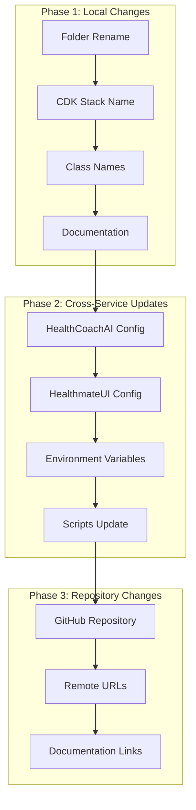

# Design Document

## Overview

HealthManagerMCPサービスを「Healthmate-HealthManager」に名前変更するための設計書です。この変更は既存のドメインロジックを一切変更せず、名前変更のみに限定します。変更は段階的に実行し、各段階で検証を行うことでリスクを最小化します。

## Architecture



## Components and Interfaces

### 1. File System Changes
- **フォルダ名変更**: `HealthManagerMCP` → `Healthmate-HealthManager`
- **ファイル参照更新**: 相対パス、インポート文の更新

### 2. CDK Infrastructure Changes
- **スタック名**: `HealthManagerMCPStack` → `Healthmate-HealthManagerStack`
- **クラス名**: `HealthManagerMCPStack` → `HealthmateHealthManagerStack`
- **リソース名**: 既存のAWSリソース名は保持（`healthmate-*`プレフィックスは変更なし）

### 3. Cross-Service Configuration
- **HealthCoachAI**: スタック名参照の更新
- **HealthmateUI**: スタック名参照の更新
- **環境変数**: `HEALTH_STACK_NAME`のデフォルト値更新

### 4. Documentation Updates
- **README.md**: サービス名、リポジトリ名の更新
- **SETUP.md**: 手順書内の名前更新
- **Steering files**: 全ての参照の更新

## Data Models

### Configuration Model
```python
class ServiceRenameConfig:
    old_name: str = "HealthManagerMCP"
    new_name: str = "Healthmate-HealthManager"
    old_stack_name: str = "HealthManagerMCPStack"
    new_stack_name: str = "Healthmate-HealthManagerStack"
    old_class_name: str = "HealthManagerMCPStack"
    new_class_name: str = "HealthmateHealthManagerStack"
```

### File Change Model
```python
class FileChange:
    file_path: str
    old_content: str
    new_content: str
    change_type: str  # "rename", "content_update", "reference_update"
```

## Correctness Properties

*A property is a characteristic or behavior that should hold true across all valid executions of a system-essentially, a formal statement about what the system should do. Properties serve as the bridge between human-readable specifications and machine-verifiable correctness guarantees.*

**Property 1: Folder name consistency**
*For any* file system operation, the service folder should use the name "Healthmate-HealthManager"
**Validates: Requirements 1.1**

**Property 2: Documentation reference consistency**
*For any* documentation file, all references to the service should use the new name "Healthmate-HealthManager"
**Validates: Requirements 1.4**

**Property 3: Cross-service reference consistency**
*For any* configuration file in other services, stack name references should use "Healthmate-HealthManagerStack"
**Validates: Requirements 1.5, 3.1, 3.2**

**Property 4: Environment variable consistency**
*For any* environment variable configuration, default values should reference the new stack name
**Validates: Requirements 3.3**

**Property 5: Documentation link consistency**
*For any* documentation file, repository URLs should reference the new repository name
**Validates: Requirements 4.4**

**Property 6: Complete reference update**
*For any* file in the project, no references to the old name "HealthManagerMCP" should remain after completion
**Validates: Requirements 5.5**

## Error Handling

### Rollback Strategy
1. **Git-based rollback**: 各段階でコミットを作成し、問題発生時は前のコミットに戻す
2. **AWS resource protection**: CDK変更時は既存リソースを保護するオプションを使用
3. **Backup verification**: 変更前に重要な設定ファイルのバックアップを作成

### Error Detection
- **Syntax validation**: 変更後のファイルの構文チェック
- **Reference validation**: 壊れた参照がないかの確認
- **Integration testing**: 他のサービスとの連携テスト

## Testing Strategy

### Unit Testing
- **File content validation**: 変更後のファイル内容が期待通りか確認
- **Configuration parsing**: 設定ファイルが正しく解析できるか確認
- **Import validation**: Pythonモジュールのインポートが正常か確認

### Property-Based Testing
- **Property tests**: 上記の正確性プロパティを検証するテスト
- **Test framework**: pytest + hypothesis
- **Test iterations**: 各プロパティテストは最低100回実行
- **Property tagging**: 各テストは対応するプロパティ番号でタグ付け

### Integration Testing
- **Cross-service validation**: 他のサービスからの参照が正常か確認
- **AWS resource validation**: CDK変更後のリソース状態確認
- **End-to-end testing**: 全体的な動作確認

## Implementation Phases

### Phase 1: Local Service Changes
1. フォルダ名の変更
2. CDKスタック名とクラス名の変更
3. ローカルドキュメントの更新
4. 検証とテスト

### Phase 2: Cross-Service Updates
1. HealthCoachAIサービスの設定更新
2. HealthmateUIサービスの設定更新
3. 環境変数とスクリプトの更新
4. 統合テスト

### Phase 3: Repository Changes
1. GitHubリポジトリ名の変更
2. リモートURLの更新
3. ドキュメント内リンクの更新
4. 最終検証

## Risk Mitigation

### High-Risk Areas
1. **CDK stack changes**: 既存AWSリソースへの影響
2. **Cross-service dependencies**: 他のサービスとの連携断絶
3. **Repository rename**: GitHubでのアクセス権限やCI/CD設定

### Mitigation Strategies
1. **Incremental deployment**: 段階的な変更とテスト
2. **Backup creation**: 重要な設定の事前バックアップ
3. **Validation scripts**: 各段階での自動検証
4. **Communication plan**: チーム内での変更通知