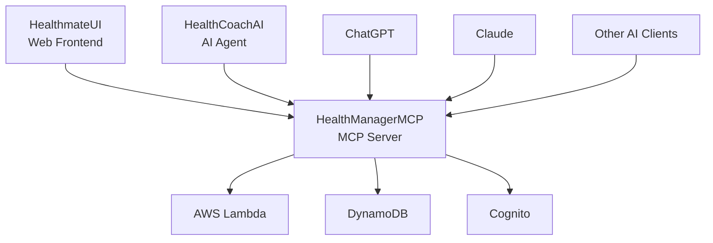
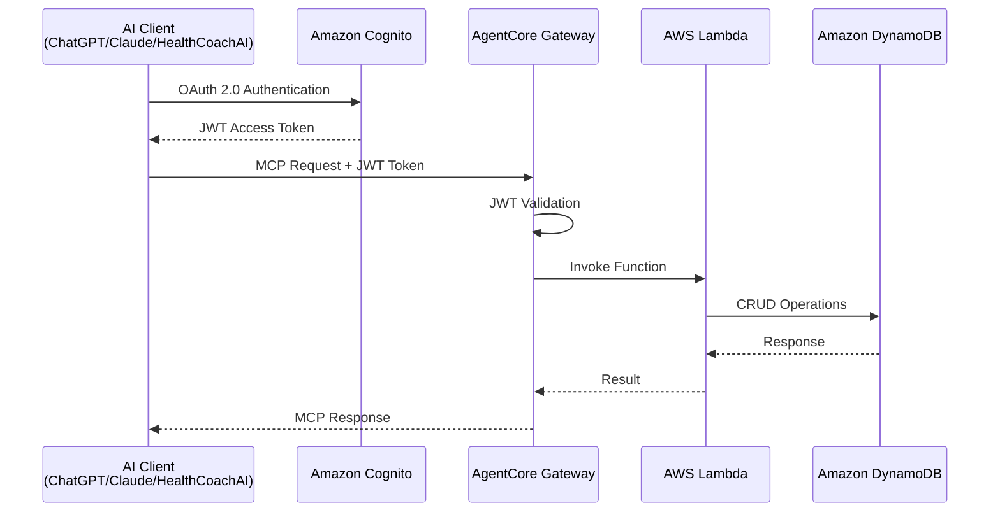

# HealthManagerMCP

[](https://opensource.org/licenses/MIT)
[](https://www.python.org/downloads/)
[](https://aws.amazon.com/cdk/)
[](https://modelcontextprotocol.io/)

**HealthManagerMCP**は、Healthmateエコシステムの中核となる健康情報管理MCPサーバーです。AWS上でサーバーレスアーキテクチャを採用し、AI健康コーチや外部AIクライアント（ChatGPT、Claude等）との連携を可能にします。

## 🌟 特徴

- 🔐 **セキュアな認証**: Cognito OAuth 2.0による堅牢な認証システム
- 🚀 **サーバーレス**: AWS Lambda + DynamoDBによる高可用性・低コスト運用
- 🤖 **AI連携**: ChatGPT、Claude、Gemini等の外部AIクライアントとの直接連携
- 📊 **包括的な健康管理**: 目標設定から日々の活動記録まで一元管理
- 🔧 **MCP準拠**: Model Context Protocolによる標準化されたAPI
- ✅ **テスト完備**: 単体テスト + 統合テストによる品質保証

## 🏗️ Healthmateエコシステム



- **HealthManagerMCP**（このプロジェクト）: 健康情報管理MCPサーバー
- **HealthCoachAI**（別プロジェクト）: AI健康コーチエージェント
- **HealthmateUI**（別プロジェクト）: Webフロントエンドアプリケーション

## 🛠️ 技術スタック

- **Backend**: AWS Lambda (Python 3.12)
- **Database**: Amazon DynamoDB
- **Authentication**: Amazon Cognito (OAuth 2.0)
- **API Gateway**: Amazon Bedrock AgentCore Gateway
- **Infrastructure**: AWS CDK (Python)
- **Testing**: pytest + hypothesis (Property-Based Testing)
- **Protocol**: Model Context Protocol (MCP)

## 主な機能

- **ユーザー管理**: ユーザー情報の作成、更新、取得
- **健康目標管理**: 長期的な健康目標（100歳まで健康寿命、アスリート体型など）の管理
- **健康ポリシー管理**: 具体的な行動ルール（ローカーボダイエット、16時間ファスティングなど）の管理
- **活動記録管理**: 日々の健康活動（体重、食事、運動、気分など）の記録と取得

## MCPツール

HealthManagerMCPは以下のMCPツールを提供します：

### UserManagement
- `addUser`: 新しいユーザー情報を作成
- `updateUser`: ユーザー情報を更新
- `getUser`: ユーザー情報を取得

### HealthGoalManagement
- `addGoal`: 新しい健康目標を追加
- `updateGoal`: 既存の健康目標を更新
- `deleteGoal`: 健康目標を削除
- `getGoals`: ユーザーのすべての健康目標を取得

### HealthPolicyManagement
- `addPolicy`: 新しい健康ポリシーを追加
- `updatePolicy`: 既存の健康ポリシーを更新
- `deletePolicy`: 健康ポリシーを削除
- `getPolicies`: ユーザーのすべての健康ポリシーを取得

### ActivityManagement
- `addActivities`: 指定した日に新しい活動を追加
- `updateActivity`: 特定の時刻の活動を部分的に更新
- `updateActivities`: 指定した日の全活動を置き換え
- `deleteActivity`: 特定の活動を削除
- `getActivities`: 指定した日の活動を取得
- `getActivitiesInRange`: 指定した期間の活動履歴を取得

## 🏛️ アーキテクチャ



## 🚀 クイックスタート

### 前提条件

- Python 3.12+
- Node.js 18+ (AWS CDK用)
- AWS CLI v2 (設定済み)
- AWS CDK Bootstrap (us-west-2リージョン)

### インストール

```bash
# リポジトリをクローン
git clone https://github.com/tomofuminijo/HealthManagerMCP.git
cd HealthManagerMCP

# Python仮想環境を作成
python3.12 -m venv .venv
source .venv/bin/activate  # macOS/Linux

# 依存関係をインストール
pip install -r requirements.txt

# CDK依存関係をインストール
cd cdk && npm install && cd ..
```

### デプロイ

```bash
# CDKスタックをデプロイ
cd cdk
cdk deploy --require-approval never

# Gateway Targetsを作成
cd ..
./create-gateway-targets.sh
```

### テスト実行

```bash
# 単体テストを実行
pytest tests/unit/ -v

# 統合テストを実行
python test_mcp_client.py
```

詳細なセットアップ手順は [SETUP.md](SETUP.md) を参照してください。

## 📖 ドキュメント

- **[セットアップガイド](SETUP.md)**: 環境構築からデプロイまでの詳細手順
- **[API仕様書](MCP_API_SPECIFICATION.md)**: 全MCPツールのAPI仕様
- **[要件定義](.kiro/specs/healthmanagermcp/requirements.md)**: システム要件の詳細
- **[設計書](.kiro/specs/healthmanagermcp/design.md)**: アーキテクチャと設計決定
- **[実装タスク](.kiro/specs/healthmanagermcp/tasks.md)**: 開発進捗と実装計画

## 🧪 テスト

### 単体テスト
```bash
pytest tests/unit/ -v
```

### 統合テスト
```bash
python test_mcp_client.py
```

### テストカバレッジ
- **Lambda関数**: 64テストケース
- **MCPスキーマ準拠**: 全ActivityType検証済み
- **認証フロー**: Cognito OAuth 2.0完全テスト
- **CRUD操作**: 全データモデル検証済み

## 🤝 AI クライアント連携

### ChatGPT
```javascript
// ChatGPT Action設定例
{
  "name": "HealthManagerMCP",
  "description": "健康情報管理システム",
  "authentication": "OAuth 2.0",
  "client_id": "YOUR_COGNITO_CLIENT_ID",
  "authorization_url": "https://healthmate.auth.us-west-2.amazoncognito.com/oauth2/authorize"
}
```

### Claude (Anthropic Console)
```python
# Claude MCP設定例
import anthropic
client = anthropic.Anthropic(
    api_key="YOUR_API_KEY",
    mcp_servers=[{
        "name": "healthmanager",
        "url": "https://your-gateway-id.agentcore.us-west-2.amazonaws.com"
    }]
)
```

## 📊 開発状況

| フェーズ | 状況 | 説明 |
|---------|------|------|
| ✅ Phase 1 | 完了 | 環境セットアップとCDK基盤 |
| ✅ Phase 2 | 完了 | バックエンド基盤（DynamoDB + Lambda） |
| ✅ Phase 3 | 完了 | 認証設定（Cognito） |
| ✅ Phase 4 | 完了 | MCP Gateway設定 |
| ✅ Phase 5 | 完了 | デプロイと動作確認 |
| ✅ Phase 6 | 完了 | テスト実装 |
| ✅ Phase 7 | 完了 | ドキュメント整備 |
| 🔄 Phase 8 | 進行中 | 本番環境への移行 |

## 🤝 コントリビューション

1. このリポジトリをフォーク
2. フィーチャーブランチを作成 (`git checkout -b feature/amazing-feature`)
3. 変更をコミット (`git commit -m 'Add amazing feature'`)
4. ブランチにプッシュ (`git push origin feature/amazing-feature`)
5. プルリクエストを作成

## 📄 ライセンス

このプロジェクトはMITライセンスの下で公開されています。詳細は [LICENSE](LICENSE) ファイルを参照してください。

## 🙏 謝辞

- [Model Context Protocol](https://modelcontextprotocol.io/) - 標準化されたAI-ツール連携プロトコル
- [AWS CDK](https://aws.amazon.com/cdk/) - インフラストラクチャ as Code
- [pytest](https://pytest.org/) - Pythonテストフレームワーク

---

**HealthManagerMCP** - Empowering AI-driven health management 🏥✨