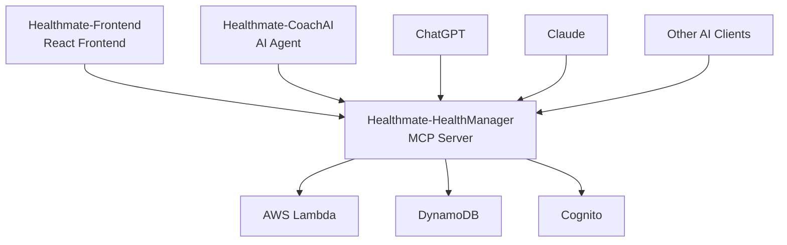
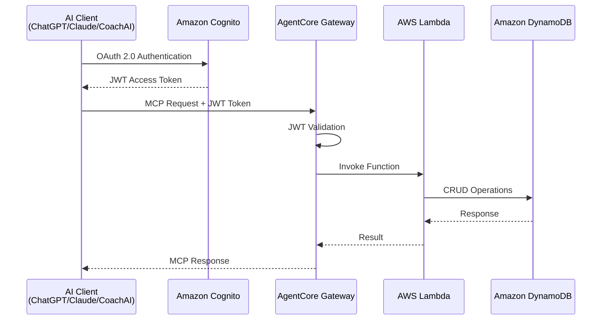
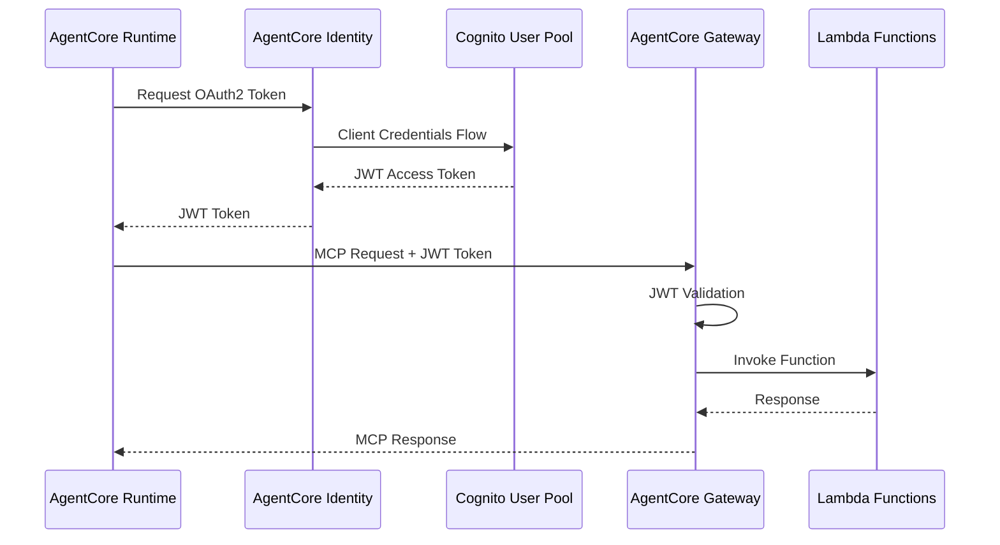

# Healthmate-HealthManager

[](https://opensource.org/licenses/MIT)
[](https://www.python.org/downloads/)
[](https://aws.amazon.com/cdk/)
[](https://modelcontextprotocol.io/)

**Healthmate-HealthManager**は、Healthmateエコシステムの中核となる健康情報管理MCPサーバーです。AWS上でサーバーレスアーキテクチャを採用し、AI健康コーチや外部AIクライアント（ChatGPT、Claude等）との連携を可能にします。

## 🌟 特徴

- 🔐 **セキュアな認証**: Cognito OAuth 2.0による堅牢な認証システム
- 🚀 **サーバーレス**: AWS Lambda + DynamoDBによる高可用性・低コスト運用
- 🤖 **AI連携**: ChatGPT、Claude、Gemini等の外部AIクライアントとの直接連携
- 📊 **包括的な健康管理**: 目標設定から日々の活動記録、日記管理まで一元管理
- 🔧 **MCP準拠**: Model Context Protocolによる標準化されたAPI
- 🏗️ **完全IaC**: CDKによる全リソースの一元管理
- ✅ **テスト完備**: 単体テスト + 統合テストによる品質保証
- 🌍 **環境分離**: Dev/Stage/Prod環境の完全分離

## �️ Healthmateエコシステム



- **Healthmate-HealthManager**（このプロジェクト）: 健康情報管理MCPサーバー
- **Healthmate-CoachAI**: AI健康コーチエージェント
- **Healthmate-Frontend**: Reactフロントエンドアプリケーション
- **Healthmate-Core**: 認証基盤サービス
- **Healthmate-App**: 統合デプロイメント管理

## 🛠️ 技術スタック

- **Backend**: AWS Lambda (Python 3.12)
- **Database**: Amazon DynamoDB
- **Authentication**: Amazon Cognito (OAuth 2.0)
- **API Gateway**: Amazon Bedrock AgentCore Gateway
- **Infrastructure**: AWS CDK (Python) - 完全なInfrastructure as Code
- **Testing**: pytest + hypothesis (Property-Based Testing)
- **Protocol**: Model Context Protocol (MCP)

## 📋 主な機能

### 健康データ管理
- **ユーザー管理**: ユーザー情報の作成、更新、取得
- **健康目標管理**: 長期的な健康目標の設定と進捗管理
- **健康ポリシー管理**: 具体的な行動ルールの定義と管理
- **健康悩み管理**: 身体的・精神的な健康上の悩みの記録と管理
- **活動記録管理**: 日々の健康活動の記録と履歴管理
- **身体測定値管理**: 体重、身長、体脂肪率の記録と履歴管理
- **日記管理**: 毎日の振り返りと気分スコアの記録

### AI連携機能
- **MCP準拠API**: 標準化されたプロトコルによるAI連携
- **M2M認証**: セキュアなマシン間認証
- **リアルタイム応答**: 低レイテンシーでの健康データ提供

## 🔧 MCPツール一覧

Healthmate-HealthManagerは以下の**32個**のMCPツールを提供します：

### UserManagement (3ツール)
- `AddUser`: 新しいユーザー情報を作成
- `UpdateUser`: ユーザー情報を更新
- `GetUser`: ユーザー情報を取得

### HealthGoalManagement (4ツール)
- `AddGoal`: 新しい健康目標を追加
- `UpdateGoal`: 既存の健康目標を更新
- `DeleteGoal`: 健康目標を削除
- `GetGoals`: ユーザーのすべての健康目標を取得

### HealthPolicyManagement (4ツール)
- `AddPolicy`: 新しい健康ポリシーを追加
- `UpdatePolicy`: 既存の健康ポリシーを更新
- `DeletePolicy`: 健康ポリシーを削除
- `GetPolicies`: ユーザーのすべての健康ポリシーを取得

### HealthConcernManagement (4ツール)
- `AddConcern`: 新しい健康上の悩みを追加
- `UpdateConcern`: 既存の健康上の悩みを更新
- `DeleteConcern`: 健康上の悩みを削除
- `GetConcerns`: ユーザーのすべての健康上の悩みを取得

### ActivityManagement (6ツール)
- `AddActivities`: 指定した日に新しい活動を追加
- `UpdateActivity`: 特定の時刻の活動を部分的に更新
- `UpdateActivities`: 指定した日の全活動を置き換え
- `DeleteActivity`: 特定の活動を削除
- `GetActivities`: 指定した日の活動を取得
- `GetActivitiesInRange`: 指定した期間の活動履歴を取得

### BodyMeasurementManagement (6ツール)
- `AddBodyMeasurement`: 身体測定値を記録
- `UpdateBodyMeasurement`: 既存の測定記録を更新
- `DeleteBodyMeasurement`: 測定記録を削除
- `GetLatestMeasurements`: 最新の測定値を取得
- `GetOldestMeasurements`: 最古の測定値を取得
- `GetMeasurementHistory`: 指定期間の測定履歴を取得

### JournalManagement (5ツール) 🆕
- `AddJournal`: 新しい日記エントリーを作成または既存エントリーに追記
- `GetJournal`: 指定した日付の日記エントリーを取得
- `GetJournalsInRange`: 指定した日付範囲の日記エントリーを取得（最大365日間）
- `UpdateJournal`: 既存の日記エントリーを完全置換
- `DeleteJournal`: 日記エントリーを削除

## 🏛️ アーキテクチャ



## 🚀 クイックスタート

### 前提条件

- Python 3.12+
- Node.js 18+ (AWS CDK用)
- AWS CLI v2 (設定済み)
- AWS CDK Bootstrap (対象リージョン)

### インストール

```bash
# リポジトリをクローン
git clone https://github.com/tomofuminijo/Healthmate-HealthManager.git
cd Healthmate-HealthManager

# Python仮想環境を作成
python3.12 -m venv .venv
source .venv/bin/activate  # macOS/Linux

# 依存関係をインストール
pip install -r requirements.txt

# CDK依存関係をインストール
cd cdk && npm install && cd ..
```

### 環境別デプロイ

```bash
# 環境変数を設定
export HEALTHMATE_ENV=dev  # dev, stage, prod

# CDKスタックをデプロイ
cd cdk
cdk deploy --require-approval never

# AgentCore Identity (OAuth2 Credential Provider) を作成
cd ..
./scripts/create-credential-provider.sh
```

### テスト実行

```bash
# 単体テストを実行
pytest tests/unit/ -v

# 統合テストを実行（全32ツール）
python test_mcp_client.py
```

### アンデプロイ

```bash
# AgentCore Identity を削除
./scripts/delete-credential-provider.sh

# CDKスタックを削除
cd cdk
cdk destroy --force
```

## 📁 プロジェクト構成

```
Healthmate-HealthManager/
├── cdk/                           # AWS CDK インフラストラクチャ
│   ├── cdk/                      # CDK Python モジュール
│   ├── app.py                    # CDK アプリケーションエントリーポイント
│   ├── requirements.txt          # CDK 依存関係
│   └── cdk.json                  # CDK 設定ファイル
├── lambda/                       # Lambda 関数ハンドラー
│   ├── user/handler.py          # ユーザー管理 Lambda
│   ├── health_goal/handler.py   # 健康目標管理 Lambda
│   ├── health_policy/handler.py # 健康ポリシー管理 Lambda
│   ├── health_concern/handler.py # 健康悩み管理 Lambda
│   ├── activity/handler.py      # 活動記録管理 Lambda
│   ├── body_measurement/handler.py # 身体測定値管理 Lambda
│   └── journal/handler.py       # 日記管理 Lambda 🆕
├── mcp-schema/                  # MCP ツールスキーマ定義
│   ├── user-management-mcp-schema.json
│   ├── health-goal-management-mcp-schema.json
│   ├── health-policy-management-mcp-schema.json
│   ├── health-concern-management-mcp-schema.json
│   ├── activity-management-mcp-schema.json
│   ├── body-measurement-mcp-schema.json
│   └── journal-management-mcp-schema.json 🆕
├── scripts/                     # デプロイ・管理スクリプト
│   ├── create-credential-provider.sh    # AgentCore Identity作成
│   ├── delete-credential-provider.sh    # AgentCore Identity削除
│   ├── deploy-full-stack.sh            # 完全デプロイ
│   └── destroy-full-stack.sh           # 完全削除
├── tests/                       # テストスイート
│   ├── unit/                    # 単体テスト
│   └── integration/             # 統合テスト
├── .kiro/specs/                 # 仕様書・設計書
│   ├── m2m-authentication-refactor/
│   ├── body-measurements/
│   └── journal-management/      # 日記管理機能仕様 🆕
│       ├── requirements.md      # 日記管理要件
│       ├── design.md           # 日記管理設計
│       └── tasks.md            # 実装タスク
├── test_mcp_client.py          # 統合テストクライアント（全32ツール対応）
├── requirements.txt            # Python 依存関係
├── pytest.ini                 # テスト設定
└── README.md                   # このファイル
```

## 📖 ドキュメント

### API仕様
- **[MCPスキーマ](mcp-schema/)**: 全32個のMCPツールのAPI仕様（JSON Schema形式）

### 機能仕様書
- **[M2M認証](.kiro/specs/m2m-authentication-refactor/)**: M2M認証システムの要件・設計・実装
- **[身体測定値管理](.kiro/specs/body-measurements/)**: 身体測定値記録機能の要件・設計・実装
- **[日記管理](.kiro/specs/journal-management/)**: 日記管理機能の要件・設計・実装 🆕

### 日記管理機能の詳細

日記管理機能は、ユーザーが毎日の振り返りを記録し、メンタルヘルスの傾向を追跡できる機能です：

#### 主な特徴
- **日記エントリー管理**: 日付ごとの日記作成・更新・削除
- **気分スコア**: 1（悪い）から5（良い）までの5段階評価
- **タグ管理**: AIが自動生成する分析用タグ（PascalCase形式）
- **追記機能**: 既存エントリーへの内容追加
- **日付範囲検索**: 最大365日間の日記履歴取得
- **データ検証**: 日付形式、気分スコア、コンテンツ長の検証

#### データ構造
```json
{
  "userId": "user-12345",
  "date": "2025-12-28",
  "content": "今日は健康管理システムのテストを実行しました...",
  "moodScore": 4,
  "tags": ["Coding", "Testing", "Happy", "Productive"],
  "createdAt": "2025-12-28T00:00:00Z",
  "updatedAt": "2025-12-28T12:00:00Z"
}
```

## 🔐 M2M認証システム

2024年12月のリファクタリングにより、AgentCore Gateway専用のM2M（Machine-to-Machine）認証システムを実装しました。

### 認証フロー



### デプロイフロー

1. **CDK Deploy**: Cognito User Pool、AgentCore Gateway、Lambda Functions等をデプロイ
2. **AgentCore Identity**: OAuth2 Credential Providerを作成してM2M認証を設定
3. **Runtime Configuration**: AgentCore RuntimeでWorkload Identityを使用

### 管理スクリプト

| スクリプト | 用途 | 説明 |
|-----------|------|------|
| `deploy-full-stack.sh` | 完全デプロイ | CDK + AgentCore Identity の一括デプロイ |
| `destroy-full-stack.sh` | 完全削除 | AgentCore Identity + CDK の一括削除 |
| `create-credential-provider.sh` | Identity作成 | OAuth2 Credential Provider単体作成 |
| `delete-credential-provider.sh` | Identity削除 | OAuth2 Credential Provider単体削除 |

## 🧪 テスト

### 単体テスト
```bash
pytest tests/unit/ -v
```

### 統合テスト
```bash
python test_mcp_client.py
```

### テストカバレッジ
- **Lambda関数**: 全27ツールの完全テスト
- **MCPスキーマ準拠**: 全ActivityType + BodyMeasurement + HealthConcern検証済み
- **認証フロー**: Cognito OAuth 2.0完全テスト
- **CRUD操作**: 全データモデル検証済み
- **身体測定値**: Latest/Oldest自動管理機能テスト済み
- **健康悩み管理**: カテゴリ・ステータス・深刻度管理機能テスト済み

## 🤝 AI クライアント連携

### ChatGPT
```javascript
// ChatGPT Action設定例
{
  "name": "Healthmate-HealthManager",
  "description": "健康情報管理システム",
  "authentication": "OAuth 2.0",
  "client_id": "YOUR_COGNITO_CLIENT_ID",
  "authorization_url": "https://healthmate.auth.us-west-2.amazoncognito.com/oauth2/authorize"
}
```

### Claude (Anthropic Console)
```python
# Claude MCP設定例
import anthropic
client = anthropic.Anthropic(
    api_key="YOUR_API_KEY",
    mcp_servers=[{
        "name": "healthmanager",
        "url": "https://your-gateway-id.agentcore.us-west-2.amazonaws.com"
    }]
)
```

## 📊 開発状況

| フェーズ | 状況 | 説明 |
|---------|------|------|
| ✅ Phase 1 | 完了 | 環境セットアップとCDK基盤 |
| ✅ Phase 2 | 完了 | バックエンド基盤（DynamoDB + Lambda） |
| ✅ Phase 3 | 完了 | 認証設定（Cognito） |
| ✅ Phase 4 | 完了 | MCP Gateway設定 |
| ✅ Phase 5 | 完了 | デプロイと動作確認 |
| ✅ Phase 6 | 完了 | テスト実装 |
| ✅ Phase 7 | 完了 | ドキュメント整備 |
| ✅ Phase 8 | 完了 | CDK統合リファクタリング（Gateway Targets統合） |
| ✅ Phase 9 | 完了 | M2M認証リファクタリング（AgentCore専用認証） |
| ✅ Phase 10 | 完了 | 身体測定値記録機能（Latest/Oldest自動管理） |
| 🔄 Phase 11 | 進行中 | 本番環境への移行 |

## 🤝 コントリビューション

1. このリポジトリをフォーク
2. フィーチャーブランチを作成 (`git checkout -b feature/amazing-feature`)
3. 変更をコミット (`git commit -m 'Add amazing feature'`)
4. ブランチにプッシュ (`git push origin feature/amazing-feature`)
5. プルリクエストを作成

## 📄 ライセンス

このプロジェクトはMITライセンスの下で公開されています。詳細は [LICENSE](LICENSE) ファイルを参照してください。

## 🙏 謝辞

- [Model Context Protocol](https://modelcontextprotocol.io/) - 標準化されたAI-ツール連携プロトコル
- [AWS CDK](https://aws.amazon.com/cdk/) - インフラストラクチャ as Code
- [pytest](https://pytest.org/) - Pythonテストフレームワーク

---

**Healthmate-HealthManager** - Empowering AI-driven health management 🏥✨